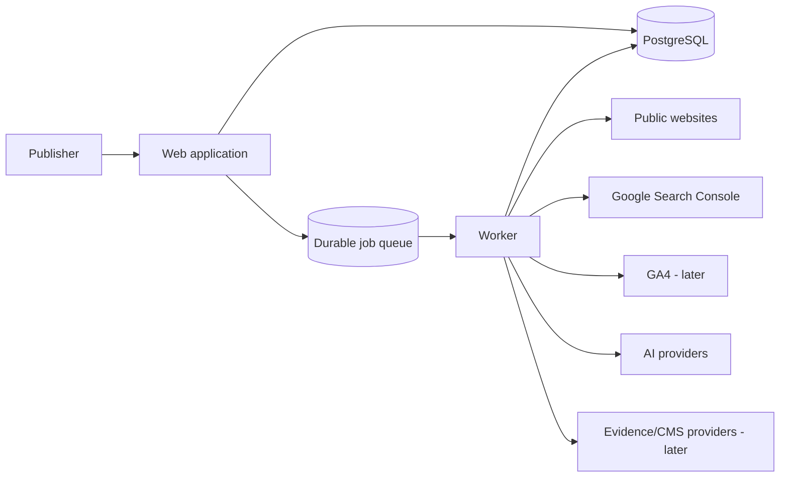
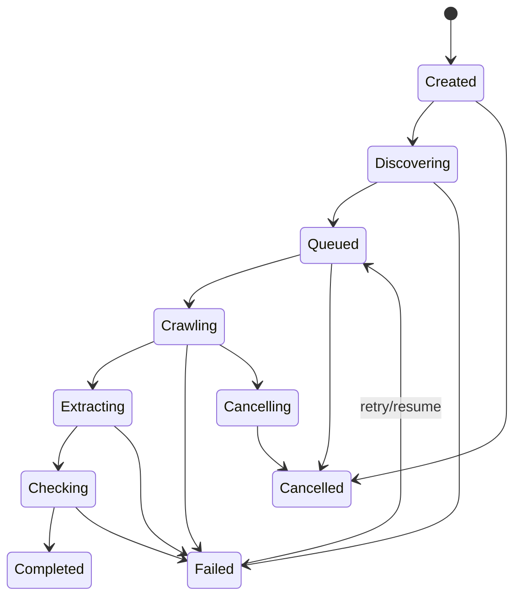

# Architecture

## Status

Provisional Phase 0 architecture. Implementation choices marked open must be resolved through an ADR before coding depends on them.

## System context

Site Quality Audit is a multi-site web application with long-running crawl, synchronization, and AI workloads. Interactive requests must remain separate from durable background execution.

## Proposed components

### Web application

Responsibilities:

- Authentication and authorization
- Site and integration configuration
- Audit creation and progress views
- Findings, scores, clusters, and remediation UI
- Credential submission without later secret disclosure
- Scheduling durable jobs
- Server-sent events or polling for live progress

Likely direction: TypeScript and Next.js. Final framework choice is provisional until ADR acceptance.

### Worker

A separately runnable process responsible for:

- Sitemap discovery
- HTTP crawling
- Browser-rendering fallback
- Extraction and deterministic checks
- Search Console and analytics synchronization
- AI requests and validation
- Clustering and score calculation
- Retry, checkpoint, and cancellation behavior

Web and worker may share packages and database models but must not share process lifecycle assumptions.

### PostgreSQL

System of record for tenant data, configuration, crawl snapshots, findings, metrics, prompts, model usage, recommendations, and remediation history.

PostgreSQL is provisionally accepted over SQLite because the planned product requires concurrent workers, multi-user access, historical snapshots, and server deployment.

### Durable job queue

Required capabilities:

- At-least-once delivery
- Retry policies and backoff
- Scheduled and dependent jobs
- Per-site and global concurrency controls
- Cancellation
- Progress reporting
- Idempotency support
- Dead-letter or failed-job inspection

Redis plus BullMQ is the leading option, but the exact implementation remains open.

### Object storage

Not required for the first foundation phase. It may later hold raw HTML, screenshots, large exports, or generated reports. The database should store references rather than large binaries when this is introduced.

## Deployment model

Docker-first.

Initial Compose services:

- `web`
- `worker`
- `postgres`
- `redis` or selected queue dependency

Production may place web and worker on the same host while keeping them as separate services. The reverse proxy and hosting provider remain open.

## Crawl lifecycle

1. Normalize and validate the site and sitemap URL.
2. Enforce network policy before each request and redirect.
3. Discover sitemap indexes and URL sets.
4. Create stable URL records and crawl jobs with idempotency keys.
5. Fetch with ordinary HTTP.
6. Use browser rendering only when configured or extraction indicates it is needed.
7. Persist an immutable page snapshot.
8. Run deterministic extraction and checks.
9. Update progress counters transactionally.
10. Complete the crawl only when terminal child jobs are accounted for.

## AI-analysis lifecycle

1. User selects pages or an audit policy selects eligible pages.
2. System calculates estimated usage and records provider/model configuration.
3. Input is cleaned, bounded, labeled as untrusted content, and associated with site context.
4. A versioned prompt and response schema are selected.
5. Worker submits request or batch.
6. Response is parsed and validated.
7. Invalid output is retried with bounded repair attempts.
8. Valid output is stored immutably with prompt version, model, usage, cost, and confidence.
9. Scores and recommendations are calculated separately from raw model output.

AI output never directly mutates site content or authorizes destructive remediation.

## Background-job design

Jobs should be coarse enough to avoid excessive queue overhead and fine enough to retry without repeating an entire audit.

Suggested hierarchy:

- Audit orchestration job
- Sitemap discovery job
- Page crawl job
- Page deterministic-analysis job
- Search data synchronization job
- Page AI-analysis job
- Cluster-generation job
- Score-calculation job
- Audit-finalization job

Each job requires:

- Tenant and site identifiers
- Stable idempotency key
- Input version
- Attempt count
- Cancellation check
- Structured result or failure code

## Idempotency

- A page snapshot is uniquely identified by crawl, normalized URL, fetch variant, and content hash policy.
- Search metrics use source, property, date, dimensions, and page/query keys.
- AI runs use page snapshot, prompt version, provider, model, and analysis mode.
- Retried jobs may update job state but must not duplicate immutable results or billable requests when a completed result already exists.

## Integration boundaries

Use explicit provider interfaces for:

- AI provider
- Search-performance provider
- Analytics provider
- CMS provider
- Evidence provider
- Rendering provider

Provider-specific tokens and response objects must not leak into domain models.

## Live progress

The database remains the source of truth. The UI may receive updates through polling or server-sent events. Queue-local progress alone is insufficient because it can disappear during restarts.

Track at least:

- URLs discovered
- URLs queued
- Fetching
- Successfully fetched
- Failed
- Deterministically analyzed
- AI queued
- AI completed
- AI failed
- Estimated and actual cost

## Failure handling

- Classify retryable and permanent failures.
- Use bounded exponential backoff.
- Record HTTP, extraction, validation, provider, quota, and policy failures separately.
- Permit page-level retries without restarting the whole audit.
- An audit may complete with warnings when a defined failure threshold is not exceeded.
- Cancellation stops new work and allows active work to finish or time out safely.

## Observability

- Structured logs with tenant-safe identifiers
- Correlation IDs spanning web request, audit, and job
- Job duration and failure metrics
- Crawl response and extraction metrics
- AI token, latency, validation, retry, and cost metrics
- Health and readiness endpoints
- Administrative failed-job inspection

Secrets, raw authorization headers, and unredacted sensitive content must not enter logs.

## Scaling

Initial deployment can use one web and one worker service. Scale workers horizontally by workload type later.

Potential future separation:

- Browser worker
- Crawl worker
- AI worker
- Synchronization worker

Concurrency must be constrained per host, per site, per provider, and globally.

## Alternatives considered

### Single-process application

Rejected provisionally because long crawls and AI runs should survive web restarts and cannot safely occupy request lifecycles.

### SQLite

Rejected provisionally for the primary deployment because concurrent workers and multi-user history are first-class requirements. It may remain useful for tests.

### Browser rendering for every page

Rejected. It is slower, more expensive, and increases attack surface. Standard HTTP is the default with explicit fallback.

### Serverless-only architecture

Not selected for the initial product because durable crawling and browser workloads fit persistent workers more naturally. Parts of the web layer may later be deployable serverlessly.

## Open decisions

- Final web framework
- ORM
- Queue implementation
- Authentication library
- Live-progress transport
- Embedding provider and vector storage
- Raw-content/object-storage policy
- Production reverse proxy and hosting
