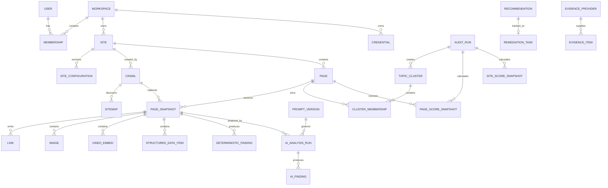

# Data Model

## Principles

- Every tenant-owned record belongs to a workspace.
- Crawls, page snapshots, findings, AI runs, metrics, and scores are historical records.
- Mutable workflow records reference immutable evidence.
- Credentials are encrypted records, not plaintext configuration fields.
- External identifiers are namespaced by provider and connection.

## Core entities

### Identity and tenancy

- **User**: authenticated person.
- **Workspace**: tenant boundary.
- **Membership**: user, workspace, role, status.

### Site configuration

- **Site**: normalized primary origin and publisher identity.
- **SiteConfiguration**: versioned crawl, language, market, exclusion, and business settings.
- **Credential**: encrypted secret payload, key version, provider, status, timestamps.
- **IntegrationConnection**: configured provider connection referencing a credential.

### Crawl inventory

- **Crawl**: one site crawl execution and summary.
- **CrawlJob**: durable unit of crawl work and retry state.
- **Sitemap**: discovered sitemap/index and fetch result.
- **Page**: stable normalized URL identity within a site.
- **PageSnapshot**: immutable fetched representation of a page during a crawl.
- **RedirectHop**: ordered redirect chain for a snapshot.
- **Link**: source snapshot to normalized target, type, placement, rel, anchor.
- **Image**: image reference and extracted metadata.
- **VideoEmbed**: embedded video/provider metadata.
- **StructuredDataItem**: parsed schema object with validation state.
- **DeterministicFinding**: rule result with evidence, severity, and rule version.

### Search and analytics

- **SearchConsoleProperty**: authorized property bound to a connection and site.
- **SearchConsoleMetric**: dated page/query/dimension metric row.
- **AnalyticsProperty**: future GA or other analytics property.
- **AnalyticsMetric**: dated metric row with provider-specific dimensions normalized into domain fields.

### AI analysis

- **PromptVersion**: immutable prompt template, schema version, purpose, and status.
- **AIAnalysisRun**: provider/model execution against a snapshot, site context, or cluster.
- **AIFinding**: validated structured result and evidence excerpts.
- **ModelUsage**: tokens, latency, provider request identifier, estimated/actual cost.

### Clustering and recommendations

- **TopicCluster**: versioned group produced for an audit.
- **ClusterMembership**: page, role, similarity, and evidence.
- **Recommendation**: immutable proposed action derived from findings and scores.
- **RemediationTask**: mutable human workflow around a recommendation.

### Auditing and scoring

- **AuditRun**: orchestration record combining one or more data sources and analysis stages.
- **PageScoreSnapshot**: immutable versioned page scores and inputs.
- **SiteScoreSnapshot**: immutable versioned aggregate scores and coverage.

### Evidence providers

- **EvidenceProvider**: configured CMS, MCP, media, journal, or custom source.
- **EvidenceItem**: normalized suggestion such as photo, video, journal entry, trip, or source document.

## Relationships

## Ownership

Every tenant record carries `workspace_id` directly or is reachable only through a parent with enforced workspace ownership. High-risk tables such as credentials, jobs, metrics, and findings should include direct workspace/site keys to simplify authorization and indexing.

## Immutable records

Treat as immutable after completion:

- PageSnapshot
- DeterministicFinding
- Search/analytics metric rows for a source import version
- PromptVersion
- AIAnalysisRun and AIFinding
- TopicCluster and membership for an audit
- PageScoreSnapshot
- SiteScoreSnapshot
- Recommendation

Corrections create replacement versions or superseding records.

## Mutable records

- User profile
- Membership status/role
- Current SiteConfiguration pointer
- IntegrationConnection status
- Credential status and rotation metadata
- Crawl/Audit/Job state while running
- RemediationTask workflow

## Key constraints

- Unique normalized site origin per workspace.
- Unique normalized URL per site.
- Unique crawl snapshot identity by crawl, page, fetch variant.
- Unique metric identity by connection/property/date/dimensions/page/query/import version.
- Unique AI run identity by target, prompt version, provider, model, analysis mode, and input hash.
- Unique score identity by audit, target, and score version.
- Credentials cannot be shared across workspaces without an explicit future feature.

## Idempotency keys

Persist idempotency keys for:

- Sitemap fetch
- Page fetch
- Deterministic analysis
- Search synchronization window
- AI submission
- Cluster generation
- Score generation

A completed matching result should be reused unless the caller explicitly requests a fresh version.

## Suggested indexes

- All tenant tables: `(workspace_id, id)`
- Page: `(site_id, normalized_url)` unique
- Snapshot: `(crawl_id, page_id)` and `(page_id, fetched_at desc)`
- Link: `(source_snapshot_id)` and `(target_page_id)`
- Finding: `(site_id, rule_key, severity)`
- Metrics: `(property_id, date, page_id)` and query/dimension variants
- AI run: `(target_type, target_id, created_at desc)`
- Remediation: `(site_id, status, priority desc)`
- Jobs: `(status, queue, scheduled_at)`

## Retention

Retention remains configurable and unresolved. The design should support:

- Keeping score and recommendation history longer than raw HTML.
- Deleting or externalizing large raw content while retaining hashes and extracted facts.
- Workspace deletion with complete tenant cleanup.
- Legal or administrative holds as a future capability.

## Open choices

- Final ORM and migration tooling
- Whether raw HTML lives in PostgreSQL or object storage
- Vector representation and storage
- Workspace exposure in the first UI
- Default retention periods
